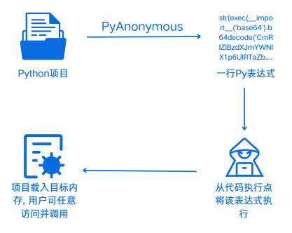
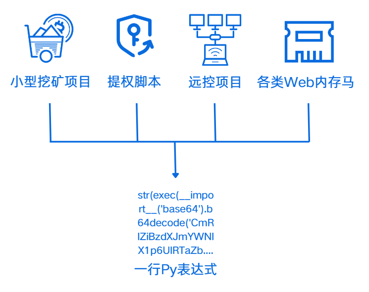

### [繁體中文](README_en.md)

<div align="center"> </div>
<p align="center">PyAnonymous: 基于Python3的无落地项目加载工具</p>


PyAnonymous(Py匿名)是一个基于Python3的无落地加载工具，它可以将一个完整的简单Py项目加载为一行简单的Py表达式.  

当在目标服务代码执行点(如exec、eval)执行该行表达式时，将会自动将该项目加载进目标内存并可通过预设的命名空间手动调用

<div align="center"> </div>

💡PyAnoymous的应用场景: 适用于在拿到代码执行点但却无法/不能深入利用的情况下对深入利用的场景进行进一步探索

🔍生成的Payload为简单的一行Py表达式代码，主要针对于无法赋值、无法多行输入的代码执行点. 

💽主要适用于不落地内存加载Py代码、无落地处理Py项目依赖并运行Py项目源码、无回显不出网等场景，用户可以直接在目标机器一键无文件落地运行Py项目代码. 

💡对于绝大部分应用(Web应用、框架)的命令执行处，都可以一键命令执行和一键写入代码

<div align="center"> </div>

🦙这是我自己的一个练手项目，希望师傅们多多包涵. 各位师傅可以提issue反馈问题

由leeya_bug开发

# 安装并使用

```cmd
git clone https://github.com/Leeyangee/PyAnonymous
cd PyLineShell
```

# 快速开始

使用Python生成一个普通版执行命令的Payload


# 鸣谢

在开发的过程中，少不了以下开源/开放代码的支持

* bfengj的Flask内存马代码: https://blog.csdn.net/rfrder/article/details/121005608

* yiqing提供的部分代码  

<div align="center"> </div>