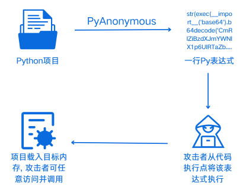

### [繁體中文](README_en.md)

<div align="center"> </div>
<p align="center">PyAnonymous: 基于Python3的无落地项目加载解决方案/p>

PyAnonymous(Py匿名)是一个基于Python3的无落地加载解决方案，它可以将一个完整的简单Py项目变为一行简单的Py表达式.  

当用户发现目标Python应用的代码执行点，并在目标服务代码执行点(如exec、eval)执行该行表达式后，将会自动将该项目加载进目标内存并可通过预设的命名空间手动调用

<div align="center"> </div>

📕PyAnoymous的应用场景: 适用于在拿到代码执行点但却无法/不能深入利用的情况下对深入利用的场景进行进一步探索

🔍生成的Payload为简单的一行Py表达式代码，主要针对于无法赋值、无法多行输入的代码执行点. 

💡对于所有小型单文件夹项目，都可以一键将其转化为Payload. 对于绝大部分应用(Web应用、框架)的命令执行处，都可以一键命令执行和一键写入代码

<div align="center"> </div>

### [点这里查看示例使用办法](使用例子/示例test.md)

⚠注意事项: 

1. 该项目仅能加载结构较为简单的Py项目(最好为单文件夹的多文件项目)，能够处理单文件夹情况下的文件间依赖. 但无法加载包含多文件夹、多package的项目. 
2. 如果一定要从如下示例所示的一个package中引入module，请在引入时，将从该package的引入语法变为能同样从module引入的语法，如下所示:
    ```py
    文件结构
    package1
        __init__.py
        module1.py

    引入规则
    from package1 import module1
    ```

🦙这是我自己的一个练手项目，希望师傅们多多包涵. 各位师傅可以提issue反馈问题

由leeya_bug开发

# 安装并使用

下载并进入PyAnonymous: 
```cmd
git clone https://github.com/Leeyangee/PyAnonymous
cd PyAnonymous
```

运行PyAnonymous: 
```cmd
python main.py
```

# 快速开始

使用Python生成一个普通版执行命令的Payload


# 鸣谢

在开发的过程中，少不了以下开源/开放代码的支持

* 

<div align="center"> </div>